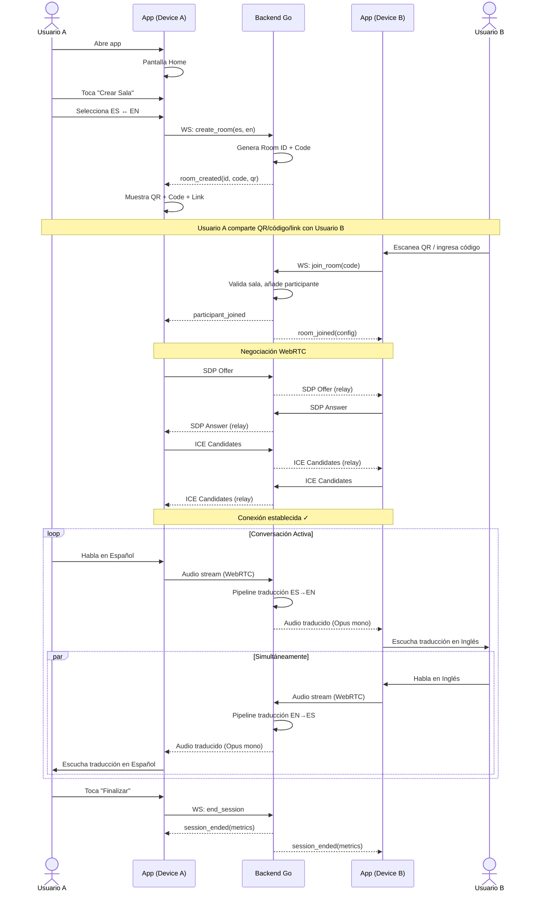

# PRD: TalkGo
## Traductor Simultáneo en Tiempo Real

| Campo | Valor |
|-------|-------|
| **Versión** | 1.1 |
| **Estado** | Draft — Pendiente revisión |
| **Fecha** | 2026-05-21 |
| **Autor** | Equipo TalkGo |

---

## 1. Resumen Ejecutivo

**TalkGo** es una plataforma de traducción bilateral en tiempo real que permite a dos personas que hablan idiomas distintos mantener una **conversación simultánea y natural**, como si hablaran el mismo idioma. A diferencia de todas las soluciones existentes — que fuerzan turnos rígidos o requieren hardware dedicado — TalkGo usa una arquitectura de **dos dispositivos cooperativos** para separar las voces desde la captura, procesarlas en paralelo, y devolver audio traducido directamente al dispositivo de cada participante.

### Propuesta de Valor Única (3 Pilares)

1. **Separación física de canales** → Cada persona usa su propio teléfono como micrófono, eliminando el problema de mezcla de voces que plaga a todas las soluciones single-device.
2. **Traducción contextual con IA** → Traducciones idiomáticas y naturales, no literales palabra-por-palabra.
3. **Simplicidad de uso** → Cada dispositivo recibe directamente la traducción del interlocutor remoto como audio mono completo. Sin configuración de auriculares ni hardware especial. Funciona con speaker o auriculares indistintamente.

---

## 2. Problema

### El Problema de Raíz
Dos personas que no comparten idioma quieren mantener una conversación fluida cara a cara. Las soluciones actuales:

- **Fuerzan turnos** ("hablar → esperar → escuchar") destruyendo la naturalidad del diálogo
- **Comparten un solo dispositivo** (pasar el teléfono) creando fricción social
- **Requieren hardware dedicado** (Timekettle WT2 Edge, ~$300 USD) excluyendo a la mayoría de usuarios
- **Producen traducciones robóticas** que no respetan el tono ni los modismos

### El Problema Técnico
Los sistemas operativos móviles (iOS/Android) **no permiten** capturar dos pistas de audio independientes simultáneamente desde un micrófono integrado y uno Bluetooth. Esto hace imposible la separación de voces en un solo dispositivo sin algoritmos de separación de fuentes (que introducen latencia y errores).

---

## 3. Personas de Usuario

### Persona 1: Viajero Frecuente — "Martín"
| Campo | Detalle |
|-------|---------|
| **Edad** | 32 años |
| **Contexto** | Viaja por trabajo a países donde no habla el idioma local |
| **Dolor** | Necesita negociar con proveedores, pero Google Translate le obliga a hablar por turnos y las traducciones pierden matices de negociación |
| **Necesidad** | Conversación fluida con su contraparte usando solo sus teléfonos |
| **Dispositivo** | iPhone 14, auriculares Bluetooth |

### Persona 2: Profesional de Salud — "Ana"
| Campo | Detalle |
|-------|---------|
| **Edad** | 45 años |
| **Contexto** | Médica que atiende pacientes que hablan otro idioma |
| **Dolor** | Necesita comunicación rápida y precisa durante consultas; los intérpretes humanos no siempre están disponibles |
| **Necesidad** | Traducción en tiempo real que no interrumpa el flujo de la consulta |
| **Dispositivo** | Android, sin auriculares dedicados |

### Persona 3: Expatriado / Inmigrante — "Yuki"
| Campo | Detalle |
|-------|---------|
| **Edad** | 28 años |
| **Contexto** | Se mudó a un nuevo país y está aprendiendo el idioma local |
| **Dolor** | Puede leer y escribir básico pero las conversaciones rápidas la superan |
| **Necesidad** | Herramienta que le permita socializar mientras aprende, con subtítulos opcionales |
| **Dispositivo** | iPhone, AirPods |

---

## 4. Análisis Competitivo

### Matriz Comparativa

| Feature | Google Translate | Apple Translate | Timekettle WT2 | MS Translator | **TalkGo** |
|---------|:---:|:---:|:---:|:---:|:---:|
| Habla simultánea | ❌ | ❌ | ✅ | ⚠️ Solo texto | **✅** |
| Dos dispositivos | ❌ | ❌ | ✅ (earbuds) | ✅ (texto) | **✅** |
| Traducción contextual | ⚠️ | ⚠️ | ❌ | ⚠️ | **✅ (LLM)** |
| Sin hardware especial | ✅ | ❌ (Apple only) | ❌ ($250+) | ✅ | **✅** |
| Funciona sin auriculares | ✅ | ✅ | ❌ | ✅ | **✅** |
| Latencia objetivo | 1-2s | Desconocida | 0.5-3s | Tiempo real (texto) | **<1s** |
| Cross-platform | ✅ | ❌ | ✅ | ✅ | **✅** |
| Precio | Gratis | Gratis | $250-350 | Gratis→Retirándose | TBD |

### Oportunidad de Mercado

> [!IMPORTANT]
> **Microsoft está retirando su feature "Converse" (multi-device translation) el 30 de junio de 2026.** Esto crea un gap directo en el mercado de traducción multi-dispositivo para consumidores.

**Timekettle WT2 Edge** es el competidor más cercano conceptualmente, pero requiere hardware dedicado de $250-350 USD, obliga a compartir un auricular (higiene), y no ofrece traducción contextual con LLM.

---

## 5. Requisitos Funcionales — MVP (Fase 1)

### RF-01: Creación y Compartición de Sala

| Campo | Detalle |
|-------|---------|
| **Descripción** | Un usuario crea una sala de traducción y la comparte con otro usuario |
| **Flujo** | Usuario A abre la app → Toca "Crear Sala" → Selecciona par de idiomas (ej: ES↔EN) → Se genera un código de sala + QR + link compartible → Usuario B escanea QR o abre link → Ambos entran a la sala |
| **Mecanismo de compartición** | Link deep-link (`talkgo://room/{id}`), QR code, código alfanumérico de 6 caracteres |
| **Criterios de Aceptación** | |
| CA-01 | El código de sala se genera en <500ms |
| CA-02 | El QR code se renderiza en pantalla correctamente y es escaneable por la cámara nativa del dispositivo |
| CA-03 | El deep link abre la app directamente en la sala si la app está instalada |
| CA-04 | El deep link redirige a la store si la app no está instalada |
| CA-05 | El código alfanumérico es case-insensitive y evita caracteres ambiguos (0/O, 1/I/l) |
| CA-06 | Una sala puede tener exactamente 2 participantes. Un tercer intento recibe error claro |
| CA-07 | La sala expira automáticamente después de 10 minutos sin actividad |

### RF-02: Selección de Par de Idiomas

| Campo | Detalle |
|-------|---------|
| **Descripción** | El creador de la sala selecciona qué idiomas habla cada participante |
| **Idiomas MVP** | Español, Inglés, Portugués, Francés, Alemán, Italiano, Japonés, Chino Mandarín, Coreano, Árabe |
| **Flujo** | Pantalla de selección con dos columnas: "Yo hablo..." / "Mi interlocutor habla..." → Dropdown con bandera + nombre del idioma |
| **Criterios de Aceptación** | |
| CA-01 | Se puede seleccionar cualquier combinación de 2 idiomas diferentes de la lista MVP |
| CA-02 | No se puede seleccionar el mismo idioma en ambas columnas |
| CA-03 | La selección se persiste para futuras sesiones (último par usado) |
| CA-04 | El segundo participante (invitado) ve los idiomas ya configurados al entrar |

### RF-03: Conexión WebRTC Peer-to-Peer

| Campo | Detalle |
|-------|---------|
| **Descripción** | Ambos dispositivos establecen una conexión de audio streaming vía WebRTC a través del servidor de Go |
| **Flujo** | Al entrar ambos participantes a la sala → Intercambio de señalización (SDP offer/answer + ICE candidates) → Establecimiento de conexión de audio → Indicador visual de "Conectado" |
| **Criterios de Aceptación** | |
| CA-01 | La conexión se establece en <3 segundos en condiciones de red normales (WiFi/4G) |
| CA-02 | Se muestra un indicador de estado: "Conectando...", "Conectado ✓", "Reconectando..." |
| CA-03 | Si la conexión falla, se reintenta automáticamente 3 veces con backoff exponencial (1s, 2s, 4s) |
| CA-04 | Se soportan redes detrás de NAT simétrico vía TURN server |
| CA-05 | El audio capturado es Opus a 48kHz mono (un canal por dispositivo) |
| CA-06 | Se muestra latencia estimada de la conexión en la UI (indicador de calidad) |

### RF-04: Captura y Transmisión de Audio

| Campo | Detalle |
|-------|---------|
| **Descripción** | Cada dispositivo captura la voz del usuario local y la transmite al backend |
| **Fuentes de audio** | Micrófono integrado del dispositivo O micrófono de auricular Bluetooth conectado |
| **Criterios de Aceptación** | |
| CA-01 | El audio se captura sin cortes perceptibles durante al menos 30 minutos continuos |
| CA-02 | La app solicita permisos de micrófono con mensaje contextual claro |
| CA-03 | Si se deniegan permisos, se muestra instrucciones para habilitarlos desde Settings |
| CA-04 | Si hay auricular Bluetooth conectado, se usa su micrófono automáticamente |
| CA-05 | Se muestra un indicador visual de nivel de audio (VU meter básico) para confirmar que el mic está captando |
| CA-06 | Botón de mute/unmute accesible en la pantalla de conversación |

### RF-05: Traducción en Tiempo Real

| Campo | Detalle |
|-------|---------|
| **Descripción** | El audio capturado se traduce al idioma del interlocutor y se reproduce como audio sintetizado |
| **Pipeline** | Ver sección 7 (Arquitectura) — decisión pendiente entre pipeline de 3 pasos vs. OpenAI Realtime |
| **Criterios de Aceptación** | |
| CA-01 | La latencia end-to-end (boca del hablante → oído del oyente) es < 1.5 segundos en el 90th percentile |
| CA-02 | La traducción preserva el sentido contextual, no es literal palabra-por-palabra |
| CA-03 | Ambos canales se procesan en paralelo — si A y B hablan al mismo tiempo, ambas traducciones se producen sin bloqueo mutuo |
| CA-04 | Si la traducción falla (timeout de API, error), se muestra un indicador visual discreto sin interrumpir el flujo |
| CA-05 | El audio traducido tiene calidad de voz natural (no robótica) |

### RF-06: Reproducción de Audio Traducido

| Campo | Detalle |
|-------|---------|
| **Descripción** | Cada dispositivo reproduce el audio traducido del interlocutor remoto. Dado que cada dispositivo solo recibe UN stream (la traducción del otro participante), no se requiere separación estéreo ni mezcla de canales |
| **Modo de salida** | Mono completo — ambos canales L/R reproducen el mismo audio. Compatible con speaker, auriculares con cable, y auriculares Bluetooth sin configuración adicional |
| **Criterios de Aceptación** | |
| CA-01 | El audio traducido se reproduce correctamente por speaker del dispositivo |
| CA-02 | El audio traducido se reproduce correctamente por auriculares Bluetooth |
| CA-03 | El audio traducido se reproduce correctamente por auriculares con cable |
| CA-04 | El volumen es ajustable con los controles físicos del dispositivo |

### RF-07: Pantalla de Conversación Activa

| Campo | Detalle |
|-------|---------|
| **Descripción** | UI principal durante una sesión de traducción |
| **Elementos** | Indicador de estado de conexión, VU meters (audio entrante/saliente), botón mute, indicador de idiomas activos, timer de sesión, botón de finalizar sesión |
| **Criterios de Aceptación** | |
| CA-01 | La pantalla se mantiene activa (no se apaga) durante una sesión |
| CA-02 | Los VU meters responden en tiempo real al audio |
| CA-03 | El botón "Finalizar" requiere confirmación ("¿Terminar conversación?") |
| CA-04 | Al finalizar, ambos dispositivos reciben notificación de fin de sesión |

---

## 6. Requisitos No Funcionales

### RNF-01: Performance

| Métrica | Objetivo MVP | Medición |
|---------|-------------|----------|
| Latencia end-to-end (voz → audio traducido) | < 1.5s (p90) | Timestamp en servidor |
| Tiempo de establecimiento de conexión WebRTC | < 3s (p90) | Cliente |
| Tiempo de generación de sala | < 500ms | Servidor |
| Uso de CPU en dispositivo móvil | < 30% sostenido | Profiling nativo |
| Uso de RAM en dispositivo móvil | < 150MB | Profiling nativo |
| Duración máxima de sesión sin degradación | 60 minutos | Testing de estrés |

### RNF-02: Disponibilidad y Resiliencia

| Requisito | Detalle |
|-----------|---------|
| Uptime del backend | 99.5% (MVP) |
| Reconexión automática | Hasta 3 intentos con backoff exponencial |
| Período de gracia por desconexión | 30 segundos antes de cerrar la sala |
| Graceful degradation | Si TTS falla, mostrar texto traducido en pantalla como fallback |

### RNF-03: Escalabilidad (MVP)

| Métrica | Objetivo |
|---------|----------|
| Sesiones concurrentes | 100 (MVP, single server) |
| Usuarios registrados | No aplica (sin auth en MVP) |
| Horizontal scaling | No requerido en MVP; arquitectura debe soportarlo a futuro |

### RNF-04: Compatibilidad

| Plataforma | Versión mínima |
|------------|----------------|
| iOS | 15.0+ |
| Android | API 28 (Android 9.0)+ |
| Bluetooth | Auriculares BLE con perfil HFP (Hands-Free Profile) |
| Red | WiFi o 4G/5G. Ancho de banda mínimo: 100kbps upstream por dispositivo |

### RNF-05: Seguridad y Privacidad

| Requisito | Detalle |
|-----------|---------|
| Cifrado de audio en tránsito | DTLS-SRTP (nativo de WebRTC) |
| Almacenamiento de audio | **NO se almacena audio en el servidor.** El audio pasa por el pipeline y se descarta |
| Datos de sala | IDs de sala, timestamps de conexión. Se eliminan al finalizar la sesión |
| Transcripciones | No se persisten en MVP. El texto pasa por el pipeline y se descarta |
| GDPR/Privacidad | Consentimiento explícito al iniciar sesión. Política de privacidad accesible desde la app |
| API Keys | Almacenadas en servidor, nunca expuestas al cliente |

---

## 7. Arquitectura del Sistema

> [!WARNING]
> ### Decisión Arquitectónica Pendiente: Pipeline de 3 Pasos vs. OpenAI Realtime Translate
>
> La investigación técnica reveló que **OpenAI lanzó una API dedicada de traducción en tiempo real** (`/v1/realtime/translations`, modelo `gpt-realtime-translate`) que hace **speech-to-speech en un solo paso** con 300-800ms de latencia a $0.034/minuto.
>
> Esto presenta **dos opciones arquitectónicas** que el equipo debe evaluar:

### Opción A: Pipeline Modular de 3 Pasos (Diseño Original)

```
[Audio WebRTC] → Faster Whisper (STT) → GPT-4o (Traducción) → ElevenLabs (TTS) → [Audio Traducido]
```

| Aspecto | Evaluación |
|---------|-----------|
| **Latencia estimada** | 1.0-2.5s (STT ~500ms + LLM ~300ms + TTS ~250ms + overhead) |
| **Costo** | Alto — 3 servicios pagos simultáneos |
| **Calidad de voz** | Excelente (ElevenLabs es líder en TTS) |
| **Calidad de traducción** | Excelente (GPT-4o con contexto semántico) |
| **Flexibilidad** | Máxima — cada componente es reemplazable independientemente |
| **Complejidad** | Alta — 3 integraciones, 3 puntos de fallo, orquestación compleja |
| **Idiomas de salida** | 32+ (ElevenLabs Flash v2.5) |
| **Riesgo** | Faster Whisper no tiene bindings Go; requiere sidecar Python/C++ |

### Opción B: OpenAI Realtime Translate (Single-Step)

```
[Audio WebRTC] → OpenAI Realtime Translate → [Audio Traducido]
```

| Aspecto | Evaluación |
|---------|-----------|
| **Latencia estimada** | 300-800ms |
| **Costo** | $0.034/min (~$2/hora por canal) |
| **Calidad de voz** | Buena (voces OpenAI, no tan premium como ElevenLabs) |
| **Calidad de traducción** | Buena (pero sin control de contexto — es intérprete puro, sin tool calls ni historial) |
| **Flexibilidad** | Baja — vendor lock-in total a OpenAI |
| **Complejidad** | Baja — una sola integración |
| **Idiomas de salida** | 13 (limitación actual) |
| **Riesgo** | Dependencia total de un solo proveedor; solo 13 idiomas de salida |

### Opción C: Híbrida (Recomendada para Evaluación)

```
Ruta Primaria:  [Audio] → OpenAI Realtime Translate → [Audio]  (para los 13 idiomas soportados)
Ruta Fallback:  [Audio] → Whisper → GPT-4o → ElevenLabs → [Audio]  (para idiomas no soportados o calidad premium)
```

| Aspecto | Evaluación |
|---------|-----------|
| **Latencia** | 300-800ms (primaria), 1-2.5s (fallback) |
| **Cobertura** | Completa — 13 idiomas rápidos + todos los demás via pipeline |
| **Complejidad** | Media-Alta — dos rutas de procesamiento |
| **MVP** | Puede empezar con Opción B y agregar pipeline como fallback |

> [!IMPORTANT]
> **Recomendación para el MVP:** Empezar con **Opción B (OpenAI Realtime)** para los idiomas MVP soportados, minimizando complejidad y latencia. Prototipar la Opción A en Fase 2 para idiomas adicionales y calidad de voz premium. La arquitectura de goroutines + channels en Go permite switchear el pipeline por canal sin cambios estructurales.

### Arquitectura de Capas (Aplicable a cualquier opción)

```
┌──────────────────────────────────────────────────────────────────────┐
│                        CAPA 1: CLIENTES                              │
│                                                                      │
│   ┌──────────────┐          Signaling          ┌──────────────┐      │
│   │ Dispositivo A │◄──── (WebSocket) ────────► │ Dispositivo B │      │
│   │  React Native │                            │  React Native │      │
│   │  Mic: Voz A   │                            │  Mic: Voz B   │      │
│   │  Spk: Trad B  │                            │  Spk: Trad A  │      │
│   └──────┬───────┘                             └──────┬───────┘      │
│          │ WebRTC Audio (mono)                        │               │
│          │ (DTLS-SRTP)                                │               │
└──────────┼────────────────────────────────────────────┼───────────────┘
           │                                            │
┌──────────▼────────────────────────────────────────────▼───────────────┐
│                        CAPA 2: BACKEND (Go)                           │
│                                                                       │
│   ┌──────────────────┐              ┌──────────────────┐              │
│   │ Goroutine Canal A │              │ Goroutine Canal B │              │
│   │ (Audio Voz A)    │              │ (Audio Voz B)    │              │
│   └────────┬─────────┘              └────────┬─────────┘              │
│            │ Go Channel                      │ Go Channel              │
│            ▼                                 ▼                         │
│   ┌────────────────────┐            ┌────────────────────┐            │
│   │ Pipeline Traducción│            │ Pipeline Traducción│            │
│   │   ES → EN          │            │   EN → ES          │            │
│   └────────┬───────────┘            └────────┬───────────┘            │
│            │ Audio traducido (mono)          │ Audio traducido (mono)  │
│            │                                 │                         │
│            ▼                                 ▼                         │
│     WebRTC Track → Device B           WebRTC Track → Device A         │
└───────────────────────────────────────────────────────────────────────┘
           │                                            │
           ▼                                            ▼
    Device A: escucha                            Device B: escucha
    traducción de B                              traducción de A
    (speaker o auriculares)                      (speaker o auriculares)
```

> [!NOTE]
> **Sin mezclador estéreo.** Cada dispositivo recibe un único stream de audio mono (la traducción del interlocutor remoto). No se requiere manipulación de canales PCM, codificación estéreo, ni `pion/opus`. Esto simplifica drásticamente la Capa 2 y elimina la necesidad de auriculares obligatorios.

### Servidor de Señalización

```
┌────────────────────────────────────────┐
│         Signaling Server (Go)          │
│                                        │
│  WebSocket endpoint: /ws/room/{id}     │
│                                        │
│  Responsabilidades:                    │
│  - Crear/destruir salas                │
│  - Intercambiar SDP offer/answer       │
│  - Relay ICE candidates               │
│  - Heartbeat (30s) + timeout           │
│  - Metadata de sesión (idiomas, etc.)  │
└────────────────────────────────────────┘
```

### Infraestructura STUN/TURN

| Componente | Tecnología | Notas |
|------------|-----------|-------|
| STUN | Google STUN público (`stun:stun.l.google.com:19302`) | Gratis, para NAT traversal simple |
| TURN | `pion/turn` embebido en el servidor Go, o servicio externo (Twilio/Xirsys) | Necesario para NAT simétrico. MVP: embebido. Producción: servicio dedicado |

---

## 8. Stack Tecnológico

| Componente | Tecnología | Versión | Justificación |
|------------|-----------|---------|---------------|
| **Frontend Móvil** | React Native | 0.74+ | Cross-platform con soporte WebRTC maduro via `react-native-webrtc` |
| **Backend** | Go (Golang) | 1.22+ | Concurrencia nativa (goroutines/channels), rendimiento, binario único |
| **WebRTC (Backend)** | `pion/webrtc` | v4.x | Implementación WebRTC pura en Go, activamente mantenida |
| **WebRTC (Frontend)** | `react-native-webrtc` | Latest | Tracks WebRTC M124, compatible con RN 0.74+ y Expo |
| **Codec de Audio** | Opus | - | Codec estándar de WebRTC, mono (un canal por stream) |
| **Señalización** | WebSocket (Go `gorilla/websocket` o `nhooyr.io/websocket`) | - | Bidireccional, baja latencia, ideal para signaling |
| **Traducción (MVP)** | OpenAI Realtime Translate API | - | Single-step S2S, 300-800ms latencia, $0.034/min |
| **STT (Fallback/Futuro)** | Faster Whisper o `whisper.cpp` | - | Para idiomas no soportados por Realtime. `whisper.cpp` tiene Go bindings via CGO |
| **LLM (Fallback/Futuro)** | OpenAI GPT-4o API | - | Traducción contextual cuando se usa pipeline de 3 pasos |
| **TTS (Fallback/Futuro)** | ElevenLabs Flash v2.5 | - | TTFA ~75ms, 32 idiomas, calidad premium |
| **QR Code** | `react-native-qrcode-svg` (frontend) / `skip2/go-qrcode` (backend) | - | Generación de QR para compartir sala |

### Dependencias de Infraestructura (MVP)

| Servicio | Proveedor | Costo Estimado MVP |
|----------|-----------|-------------------|
| Server (Backend Go) | Railway / Fly.io / VPS | ~$20-50/mes |
| STUN | Google (gratis) | $0 |
| TURN | Embebido (`pion/turn`) | $0 (ancho de banda del server) |
| OpenAI Realtime | OpenAI | $0.034/min × uso |
| Deep linking | Firebase Dynamic Links / Branch.io | Free tier |

---

## 9. Modelo de Datos

### Room (Sala)

```go
type Room struct {
    ID            string        // UUID v4
    Code          string        // Código alfanumérico 6 chars (ej: "A3X7K9")
    SourceLang    string        // ISO 639-1 (ej: "es")
    TargetLang    string        // ISO 639-1 (ej: "en")
    CreatedAt     time.Time
    ExpiresAt     time.Time     // CreatedAt + 10min si vacía, se extiende con actividad
    Status        RoomStatus    // WAITING | ACTIVE | CLOSED
    Participants  [2]*Participant
}
```

### Participant (Participante)

```go
type Participant struct {
    ID            string        // UUID v4
    DeviceID      string        // Fingerprint del dispositivo
    Language      string        // Idioma que habla este participante
    JoinedAt      time.Time
    Connection    *webrtc.PeerConnection
    AudioTrack    *webrtc.TrackLocalStaticSample
    IsMuted       bool
}
```

### Session Metrics (Métricas de Sesión)

```go
type SessionMetrics struct {
    RoomID           string
    Duration         time.Duration
    AvgLatencyMs     float64    // Latencia promedio del pipeline
    P90LatencyMs     float64
    AudioChunks      int64      // Total de chunks procesados
    TranslationCalls int64      // Llamadas a API de traducción
    Errors           int        // Errores durante la sesión
}
```

> [!NOTE]
> En MVP no hay persistencia de datos — todo vive en memoria del servidor Go. No hay base de datos. Las métricas se logean a stdout/archivo para análisis post-sesión.

---

## 10. Contratos de API

### WebSocket — Señalización

**Endpoint:** `wss://{host}/ws/room/{roomId}`

#### Mensajes Cliente → Servidor

```json
// Crear sala
{"type": "create_room", "source_lang": "es", "target_lang": "en"}

// Unirse a sala
{"type": "join_room", "room_code": "A3X7K9"}

// SDP Offer/Answer
{"type": "sdp", "sdp": {"type": "offer|answer", "sdp": "..."}}

// ICE Candidate
{"type": "ice_candidate", "candidate": {"candidate": "...", "sdpMid": "...", "sdpMLineIndex": 0}}

// Mute/Unmute
{"type": "mute", "muted": true}

// Heartbeat
{"type": "ping"}
```

#### Mensajes Servidor → Cliente

```json
// Sala creada
{"type": "room_created", "room_id": "uuid", "room_code": "A3X7K9", "qr_data": "talkgo://room/uuid"}

// Participante conectado
{"type": "participant_joined", "participant_id": "uuid", "language": "en"}

// SDP (relay)
{"type": "sdp", "sdp": {"type": "offer|answer", "sdp": "..."}}

// ICE Candidate (relay)
{"type": "ice_candidate", "candidate": {...}}

// Estado de conexión
{"type": "connection_status", "status": "connected|reconnecting|disconnected"}

// Error
{"type": "error", "code": "ROOM_FULL|ROOM_NOT_FOUND|ROOM_EXPIRED", "message": "..."}

// Heartbeat response
{"type": "pong"}

// Sesión finalizada
{"type": "session_ended", "reason": "user_left|timeout|error", "metrics": {...}}
```

---

## 11. Flujo de Usuario — MVP

### Flujo Completo: Crear y Unirse a una Sala



---

## 12. Edge Cases y Manejo de Errores

| Escenario | Comportamiento Esperado | Prioridad |
|-----------|------------------------|-----------|
| **Ambos hablan al mismo tiempo** | Ambas goroutines procesan en paralelo. Sin bloqueo mutuo. Audio traducido de cada uno llega al dispositivo del otro como stream mono independiente | P0 — Es la feature core |
| **Pérdida de conexión de red (transitoria)** | Reconexión automática con ICE restart. Período de gracia: 30s. UI muestra "Reconectando..." | P0 |
| **Pérdida de conexión permanente** | Después de 3 reintentos, se notifica al otro participante y se cierra la sala | P0 |
| **API de traducción devuelve error** | Log del error. Si es transitorio (429, 503), retry con backoff. Si es persistente, UI muestra "Traducción temporalmente no disponible" con audio original como fallback | P1 |
| **API de traducción responde lento (>3s)** | Descartar el chunk de audio antiguo. Procesar solo el chunk más reciente. No acumular backlog | P0 |
| **Bluetooth se desconecta mid-sesión** | Fallback automático a micrófono integrado. Notificación al usuario: "Auricular desconectado, usando micrófono del teléfono" | P1 |
| **App pasa a background (iOS)** | Solicitar background audio mode. Mantener conexión WebRTC activa. Si iOS la mata, reconexión al volver a foreground | P1 |
| **App pasa a background (Android)** | Foreground service con notificación persistente. Mantener sesión activa | P1 |
| **Ruido de fondo excesivo** | WebRTC incluye noise suppression nativo. Si SNR es muy bajo, mostrar indicador "Ambiente ruidoso" | P2 |
| **Tercer usuario intenta unirse** | Error claro: "Esta sala ya tiene 2 participantes" | P0 |
| **Sala expirada** | Error: "Esta sala expiró. Creá una nueva." | P0 |
| **Mismo idioma seleccionado para ambos** | UI previene la selección. Dropdown del segundo idioma excluye el primero | P0 |

---

## 13. Métricas de Éxito — MVP

### Métricas Técnicas (Instrumentación)

| Métrica | Target MVP | Herramienta |
|---------|-----------|-------------|
| Latencia end-to-end (p50) | < 1.0s | Timestamps en pipeline Go |
| Latencia end-to-end (p90) | < 1.5s | Timestamps en pipeline Go |
| Tasa de conexión exitosa | > 95% | Logs de señalización |
| Tasa de reconexión exitosa | > 80% | Logs de WebRTC |
| Errores de pipeline por sesión | < 2% de chunks | Logs de traducción |
| Duración promedio de sesión | > 5 min (indica utilidad real) | Logs de sesión |

### Métricas de Producto (Post-MVP)

| Métrica | Target | Método |
|---------|--------|--------|
| Sesiones completadas (no abandonadas) | > 70% | Analytics |
| NPS (Net Promoter Score) | > 40 | Encuesta in-app |
| Retención D7 | > 30% | Analytics |
| Salas creadas por usuario activo | > 2/semana | Analytics |

---

## 14. Roadmap de Features Futuras

> [!NOTE]
> Estas features NO son parte del MVP. Se documentan como referencia para planificación futura.

### Fase 2: Pipeline Dual + Subtítulos (Post-MVP)

- [ ] Integrar pipeline de 3 pasos (Whisper → GPT-4o → ElevenLabs) como ruta alternativa
- [ ] Transcripción en pantalla — subtítulos en vivo del texto original y traducido
- [ ] Soporte de idiomas adicionales via pipeline modular
- [ ] Historial de conversaciones — guardar transcripción (texto) de sesiones pasadas
- [ ] Selector de voz (elegir entre voces disponibles de TTS)

### Fase 3: Experiencia Premium

- [ ] Voice cloning — que la traducción suene como la voz original del hablante
- [ ] Chat de texto como fallback — cuando no se puede hablar
- [ ] Configuración de velocidad de habla y tono
- [ ] Análisis de sentimiento / tono emocional con indicadores visuales
- [ ] Modo offline / fallback con modelos on-device (SeamlessM4T cuando madure)

### Fase 4: Escala y API

- [ ] Extraer el pipeline de traducción como microservicio independiente (gRPC/WebSocket API)
- [ ] Modo conferencia — más de 2 participantes con diferenciación de hablantes
- [ ] API pública de traducción para integración en aplicaciones terceras
- [ ] SDK para desarrolladores (JavaScript / Python / Go)
- [ ] Multi-tenancy y autenticación para clientes enterprise
- [ ] Panel de analytics para usuarios empresariales
- [ ] Soporte para dialectos regionales

### Fase 5: Enterprise Integration (Embebido en Plataformas de Video)

> [!NOTE]
> La arquitectura hexagonal habilita esta fase naturalmente: cada plataforma es un **nuevo adapter** en `internal/adapters/` que implementa los mismos ports. El pipeline de traducción (dominio) no cambia.

- [ ] **Zoom Integration** — Adapter vía Zoom RTMS (Realtime Media Streams, WebSocket). Recibir audio per-participant, traducir, inyectar de vuelta. Registrar app en Zoom Marketplace.
- [ ] **Teams Integration** — Adapter vía Real-Time Media Bot (Graph Communications API). Bot que se une a meetings como participante, recibe PCM 20ms frames, traduce, reproduce. Requiere .NET companion service + Azure VM.
- [ ] **Google Meet Integration** — Adapter vía Meet Media API (cuando salga de Developer Preview) o Chrome Extension (`chrome.tabCapture`) como stopgap.
- [ ] **Desktop Universal** — Adapter vía Virtual Audio Device (modelo Krisp.ai) para funcionar con CUALQUIER app de videoconferencia sin integración específica. Alto costo de desarrollo (kernel driver).
- [ ] **Recall.ai integration** — Evaluar como capa de abstracción para manejar múltiples plataformas con una sola API, eliminando la necesidad de mantener bots separados.
- [ ] Certificación en Zoom Marketplace y Microsoft Teams App Store
- [ ] Compliance: SOC 2 Type II, ISO 27001 (requerido por enterprise)

---

## 15. Riesgos y Mitigaciones

| # | Riesgo | Severidad | Probabilidad | Mitigación |
|---|--------|-----------|-------------|------------|
| R1 | **Latencia acumulada > target con pipeline 3-pasos** | Alta | Alta | Usar OpenAI Realtime como ruta primaria en MVP. Pipeline 3-pasos como fallback futuro |
| R2 | **Bluetooth + React Native WebRTC** | Media | Media | Prototipar captura de audio vía Bluetooth en Sprint 0. Audio es mono simple — sin complicaciones de estéreo. Si Bluetooth falla, fallback a micrófono integrado |
| R3 | **OpenAI Realtime Translate API — vendor lock-in** | Media | Media | Arquitectura de pipeline abstracta (interface Go). Cambiar de proveedor es swap de implementación, no de arquitectura |
| R4 | **Costos de API a escala** | Media | Media | Monitoring de costos por sesión. Rate limiting por sala. Considerar modelos on-device para STT (Fase 3) |
| R5 | **Faster Whisper sin bindings Go** | Media | Confirmado | Usar `whisper.cpp` con Go bindings via CGO, o correr Faster Whisper como sidecar gRPC |
| R6 | **iOS mata la app en background** | Media | Alta | Configurar `UIBackgroundModes: audio`. Usar `react-native-incall-manager`. Testing extensivo en iOS real |
| R7 | **Calidad de voz de OpenAI Realtime inferior a ElevenLabs** | Baja | Media | Aceptable para MVP. Pipeline premium (ElevenLabs) disponible en Fase 2 |
| R8 | **Solo 13 idiomas de salida en OpenAI Realtime** | Media | Confirmado | Los 10 idiomas MVP están cubiertos (verificar). Pipeline modular como fallback |

---

## 16. Plan de Desarrollo — MVP

### Sprint 0: Setup y Prototipos (1 semana)

- [ ] Setup del monorepo (Go backend + React Native frontend)
- [ ] Scaffolding de arquitectura hexagonal + AI agent harness
- [ ] Setup CI/CD básico (lint, build, test)
- [ ] Configurar cuentas de API (OpenAI, STUN/TURN)
- [ ] Spike: Captura de audio Bluetooth en RN WebRTC (iOS y Android)

### Sprint 1: Señalización + WebRTC (2 semanas)

- [ ] Servidor de señalización WebSocket en Go
- [ ] Modelo de Room + Participant en memoria
- [ ] Generación de código de sala + QR
- [ ] Client React Native: pantalla Home + Crear Sala + Unirse
- [ ] Negociación WebRTC (SDP + ICE) end-to-end
- [ ] Audio streaming bidireccional sin traducción (echo test — audio mono)
- [ ] Testing: 2 dispositivos reales enviando/recibiendo audio

### Sprint 2: Pipeline de Traducción (2 semanas)

- [ ] Integración con OpenAI Realtime Translate API
- [ ] Goroutines + Channels para procesamiento paralelo de canales
- [ ] Traducción funcional: audio A → traducción → audio B (y viceversa, streams mono independientes)
- [ ] Testing: conversación real entre 2 personas con idiomas diferentes

### Sprint 3: UX y Edge Cases (1 semana)

- [ ] UI de conversación activa (VU meters, estado, mute)
- [ ] Reconexión automática
- [ ] Manejo de errores de API
- [ ] Background mode (iOS/Android)
- [ ] Testing de edge cases: desconexión, timeout, sala llena

### Sprint 4: Polish y Alpha (1 semana)

- [ ] Instrumentación de métricas (latencia, errores)
- [ ] Testing en redes reales (4G, WiFi pública)
- [ ] Testing con usuarios reales (alpha interna)
- [ ] Bug fixes y ajustes de latencia
- [ ] Documentación para el equipo

**Total estimado MVP: 7 semanas**

---

## Apéndice A: Idiomas Soportados — MVP

| Idioma | ISO 639-1 | OpenAI Realtime Output | Verificado |
|--------|-----------|:---:|:---:|
| Español | `es` | ✅ | Pendiente |
| Inglés | `en` | ✅ | Pendiente |
| Portugués | `pt` | ✅ | Pendiente |
| Francés | `fr` | ✅ | Pendiente |
| Alemán | `de` | ✅ | Pendiente |
| Italiano | `it` | ✅ | Pendiente |
| Japonés | `ja` | ✅ | Pendiente |
| Chino Mandarín | `zh` | ✅ | Pendiente |
| Coreano | `ko` | ✅ | Pendiente |
| Árabe | `ar` | ⚠️ Verificar | Pendiente |

> [!NOTE]
> La lista de 13 idiomas de salida soportados por OpenAI Realtime Translate necesita verificación oficial contra los idiomas MVP seleccionados. Si algún idioma MVP no está soportado, se usa el pipeline de 3 pasos como fallback.

## Apéndice B: Glosario

| Término | Definición |
|---------|-----------|
| **TalkGo** | Nombre del proyecto. "Talk" (hablar) + "Go" (acción / referencia al lenguaje del backend) |
| **STT** | Speech-to-Text. Conversión de voz a texto |
| **TTS** | Text-to-Speech. Conversión de texto a voz sintetizada |
| **S2ST** | Speech-to-Speech Translation. Traducción directa de voz a voz |
| **SDP** | Session Description Protocol. Describe las capacidades multimedia para WebRTC |
| **ICE** | Interactive Connectivity Establishment. Protocolo para NAT traversal |
| **STUN** | Session Traversal Utilities for NAT. Descubre IP pública |
| **TURN** | Traversal Using Relays around NAT. Relay de media cuando conexión directa no es posible |
| **Opus** | Codec de audio versátil, estándar en WebRTC |
| **PCM** | Pulse Code Modulation. Audio sin comprimir, formato para manipulación |
| **DTLS-SRTP** | Protocolo de cifrado para media en WebRTC |
| **Goroutine** | Unidad de ejecución concurrente ligera en Go |
| **Channel** | Primitiva de comunicación entre goroutines en Go |
| **VU Meter** | Volume Unit meter. Indicador visual de nivel de audio |
| **NAT** | Network Address Translation. Traduce IPs privadas a públicas |
| **AEC** | Acoustic Echo Cancellation. Eliminación de eco acústico |
| **HFP** | Hands-Free Profile. Perfil Bluetooth para audio bidireccional |
